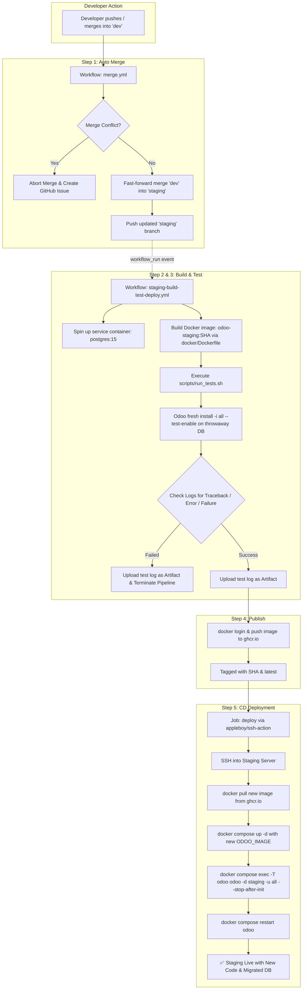

# Comprehensive Guide: Odoo 19 CI/CD Pipeline & Automated Workflow

This document provides a complete, step-by-step architectural and code-level explanation of the automated CI/CD pipeline implemented in this repository. Use this guide for knowledge sharing, team training sessions, onboarding, and reference.

---

## Table of Contents
1. [Overview & Architecture](#1-overview--architecture)
2. [End-to-End Workflow Diagram](#2-end-to-end-workflow-diagram)
3. [Step-by-Step Pipeline Breakdown](#3-step-by-step-pipeline-breakdown)
   - [Step 1: Automatic Merge (`dev` → `staging`)](#step-1-automatic-merge-dev--staging)
   - [Step 2: Docker Image Build](#step-2-docker-image-build)
   - [Step 3: Ephemeral Database Testing](#step-3-ephemeral-database-testing)
   - [Step 4: Image Tagging & Registry Publishing (GHCR)](#step-4-image-tagging--registry-publishing-ghcr)
   - [Step 5: Automated Staging Deployment](#step-5-automated-staging-deployment)
4. [Line-by-Line Code Walkthrough](#4-line-by-line-code-walkthrough)
   - [A. `docker/Dockerfile`](#a-dockerdockerfile)
   - [B. `scripts/run_tests.sh`](#b-scriptsrun_testssh)
   - [C. `.github/workflows/merge.yml`](#c-githubworkflowsmergeyml)
   - [D. `.github/workflows/staging-build-test-deploy.yml`](#d-githubworkflowsstaging-build-test-deployyml)
   - [E. `docker/docker-compose.staging.yml.example`](#e-dockerdocker-composestagingymlexample)
5. [Key Design Choices & Problem Solving](#5-key-design-choices--problem-solving)
6. [Presentation & Knowledge Sharing Guide](#6-presentation--knowledge-sharing-guide)

---

## 1. Overview & Architecture

### The Problem with Traditional Odoo Deployments
* Developers push directly to target branches or manually SSH into servers to `git pull` and run `-u <module>`.
* Syntax errors, missing dependencies in `requirements.txt`, or broken XML views cause staging or production servers to crash.
* No trace of who deployed what or how test logs looked at deployment time.

### The Solution: Automated CI/CD
This repository implements a production-grade automated pipeline mirroring `odoo.sh`'s merge-to-staging behavior:
1. **Continuous Integration (CI):** Every push to `dev` merges into `staging`, builds a Docker image with all custom addons and pip dependencies baked in, and runs automated tests on a fresh, isolated PostgreSQL database.
2. **Quality Gates:** The build strictly checks for `CRITICAL`, `ERROR`, `FAILED`, and Python `Traceback` lines in the logs. If anything is wrong, the pipeline fails and saves the log as a build artifact.
3. **Continuous Delivery (CD):** When tests pass, the container image is pushed to GitHub Container Registry (GHCR) and automatically deployed to the staging server over SSH with database migration (`-u all`) and zero downtime.

---

## 2. End-to-End Workflow Diagram



---

## 3. Step-by-Step Pipeline Breakdown

### Step 1: Automatic Merge (`dev` → `staging`)
* **Trigger:** Push to `dev` branch.
* **File:** `.github/workflows/merge.yml`
* **Action:** Checks out `staging`, pulls latest changes, and attempts a `git merge origin/dev`.
* **Fail-safe:** If there is a merge conflict, it cancels cleanly (`git merge --abort`) and automatically files a GitHub Issue with instructions for developers to resolve the conflict locally.

### Step 2: Docker Image Build
* **Trigger:** Completion of the merge workflow via `workflow_run`.
* **File:** `docker/Dockerfile`
* **Action:** Takes the base official `odoo:19.0` image, bakes in all custom modules located in `addons/`, and installs any Python dependencies specified in `requirements.txt`.
* **Tagging:** The image is tagged with the unique Git commit SHA (`head_sha`).

### Step 3: Ephemeral Database Testing
* **Service:** A clean `postgres:15` database container is started on the GitHub runner.
* **File:** `scripts/run_tests.sh`
* **Action:** 
  1. Dynamically detects all custom module directories in `addons/`.
  2. Creates a timestamped throwaway database (e.g. `ci_test_1727845000`).
  3. Executes `odoo -d <test_db> -i <modules> --test-enable --test-tags=<tags> --stop-after-init`.
  4. Scans raw logs with regex for any `ERROR`, `CRITICAL`, `FAILED`, or `Traceback`.
  5. Uploads the full Odoo execution log as a GitHub artifact (`odoo-test-log`, retained for 14 days).

### Step 4: Image Tagging & Registry Publishing (GHCR)
* **Condition:** Only runs if the test step succeeds.
* **Registry:** GitHub Container Registry (`ghcr.io`).
* **Tags:** Pushes two tags:
  1. `ghcr.io/<org>/<repo>/odoo-staging:<commit-sha>` (Immutable, exact version).
  2. `ghcr.io/<org>/<repo>/odoo-staging:latest` (Convenience pointer).

### Step 5: Automated Staging Deployment
* **Job:** `deploy` in `.github/workflows/staging-build-test-deploy.yml`
* **Execution:** Connects to the staging server over secure SSH:
  1. Pulls the new Docker image from GHCR using the specific commit SHA.
  2. Updates `/opt/odoo-staging/docker-compose.yml` environment variable `ODOO_IMAGE`.
  3. Recreates the Odoo container (`docker compose up -d`).
  4. Executes `-u all --stop-after-init` on the real persistent staging database.
  5. Restarts the Odoo container to serve the updated modules.

---

## 4. Line-by-Line Code Walkthrough

### A. `docker/Dockerfile`

```dockerfile
# Odoo 19 build image — bakes custom addons + python deps into the official image
FROM odoo:19.0

USER root

# Custom addons live in ./addons at repo root (one folder per module)
COPY ./addons /mnt/extra-addons

# Optional extra python deps used by custom addons
COPY ./requirements.txt /tmp/requirements.txt
RUN if [ -s /tmp/requirements.txt ]; then \
        pip3 install --no-cache-dir --break-system-packages -r /tmp/requirements.txt ; \
    fi

USER odoo
```

* `FROM odoo:19.0`: Base image containing Odoo 19 core, Python environment, and Debian dependencies.
* `USER root`: Gives root permissions to install packages and copy files into system folders.
* `COPY ./addons /mnt/extra-addons`: Copies all custom modules into the standard extra-addons directory.
* `COPY ./requirements.txt /tmp/requirements.txt`: Copies third-party requirements file.
* `RUN if [ -s /tmp/requirements.txt ]; then ... fi`: Checks if `requirements.txt` has content (> 0 bytes). If not empty, installs dependencies.
  * `--no-cache-dir`: Keeps image size small by omitting the pip download cache.
  * `--break-system-packages`: Allows pip installs in Debian/Ubuntu PEP 668 environments.
* `USER odoo`: Reverts to the unprivileged `odoo` user for secure runtime.

---

### B. `scripts/run_tests.sh`

```bash
#!/usr/bin/env bash
set -uo pipefail

IMAGE="${1:?Usage: run_tests.sh <image> <db_host> <db_user> <db_password>}"
DB_HOST="${2:?missing db host}"
DB_USER="${3:?missing db user}"
DB_PASSWORD="${4:?missing db password}"

TEST_DB="ci_test_$(date +%s)"
LOG_FILE="/tmp/odoo_test_${TEST_DB}.log"

# Auto-detect every custom module folder under ./addons
MODULES=$(ls addons | paste -sd, -)
if [ -z "$MODULES" ]; then
  echo "No modules found under ./addons — nothing to test."
  exit 0
fi
echo "Modules to install & test: $MODULES"

# Build "/mod1,/mod2,/mod3" so --test-tags runs tests scoped to just these modules
TEST_TAGS=$(echo "$MODULES" | tr ',' '\n' | sed 's#^#/#' | paste -sd, -)

docker run --rm \
  --network host \
  -e HOST="$DB_HOST" \
  -e USER="$DB_USER" \
  -e PASSWORD="$DB_PASSWORD" \
  "$IMAGE" \
  odoo -d "$TEST_DB" \
    --addons-path=/usr/lib/python3/dist-packages/odoo/addons,/mnt/extra-addons \
    -i "$MODULES" \
    --test-enable \
    --test-tags="$TEST_TAGS" \
    --stop-after-init \
    --log-level=test \
    --without-demo=False \
  2>&1 | tee "$LOG_FILE"

RUN_EXIT=${PIPESTATUS[0]}

echo "---- scanning log for failures ----"
if grep -E -i "CRITICAL |ERROR |FAILED |Traceback \(most recent call last\)" "$LOG_FILE"; then
  echo "❌ Errors/tracebacks found in install/test log — failing build."
  exit 1
fi

if [ "$RUN_EXIT" -ne 0 ]; then
  echo "❌ odoo-bin exited non-zero ($RUN_EXIT) — failing build."
  exit 1
fi

echo "✅ Install + tests completed with no errors."
```

* `set -uo pipefail`: Fails on unset variables (`-u`) and propagates pipeline failures (`pipefail`).
* `TEST_DB="ci_test_$(date +%s)"`: Creates a unique, timestamp-isolated database for the test run.
* `MODULES=$(ls addons | paste -sd, -)`: Dynamically scans `addons/` and formats module names as comma-separated values (`mod1,mod2`).
* `TEST_TAGS=...`: Formats tags as `/mod1,/mod2` so Odoo only tests custom modules and skips core Odoo test suites.
* `docker run --rm --network host`: Executes test container using host network to talk to Postgres service container on port 5432.
* `--stop-after-init`: Shuts down Odoo automatically once installation and tests are complete.
* `2>&1 | tee "$LOG_FILE"`: Writes output to console and `$LOG_FILE` simultaneously.
* `grep -E -i "CRITICAL |ERROR |FAILED |Traceback ..."`: Scans the log to catch any errors that did not result in a non-zero exit code (e.g. XML view errors, template issues).

---

### C. `.github/workflows/merge.yml`

```yaml
name: Merge Dev to Staging

on:
  push:
    branches: [dev]
  workflow_dispatch:   # manual trigger

permissions:
  contents: write
  issues: write

concurrency:
  group: merge-dev-to-staging
  cancel-in-progress: false   # sequential merging

jobs:
  merge:
    runs-on: ubuntu-latest

    steps:
      - name: Checkout
        uses: actions/checkout@v5
        with:
          fetch-depth: 0   # Full commit history for git merge

      - name: Configure Git
        run: |
          git config user.name "aktiv-jay-butani"
          git config user.email "jay.butani@aktivsoftware.com"

      - name: Fetch branches
        run: git remote update

      - name: Checkout staging
        run: |
          git checkout -B staging origin/staging
          git pull origin staging

      - name: Merge dev
        id: merge
        run: |
          set +e
          git merge origin/dev --no-edit
          echo "status=$?" >> "$GITHUB_OUTPUT"
          set -e

      - name: Abort cleanly on conflict
        if: steps.merge.outputs.status != '0'
        run: |
          git merge --abort
          echo "::error::Merge conflict between dev and staging — resolve manually and push staging yourself."
          exit 1

      - name: Open an issue if the merge conflicted
        if: failure()
        env:
          GH_TOKEN: ${{ github.token }}
        run: |
          gh issue create \
            --repo "${{ github.repository }}" \
            --title "Auto-merge dev → staging failed: conflict" \
            --body "The scheduled merge from dev into staging hit a conflict and was aborted automatically. Resolve it locally: checkout staging, \`git merge origin/dev\`, fix the conflicting file(s), commit, and push staging yourself."

      - name: Push staging
        run: git push origin staging
```

* `concurrency: cancel-in-progress: false`: Ensures that back-to-back commits on `dev` are processed sequentially without canceling an active merge.
* `fetch-depth: 0`: Downloads full history so Git can identify the merge-base ancestor.
* `git merge origin/dev --no-edit`: Executes non-interactive merge.
* `gh issue create`: If merge conflicts occur, creates a tracked GitHub Issue to notify developers with exact fix instructions.
* `git push origin staging`: Pushes merged commits to `staging`.

---

### D. `.github/workflows/staging-build-test-deploy.yml`

```yaml
name: Staging Build, Test & Deploy

on:
  workflow_run:
    workflows: ["Merge Dev to Staging"]
    types: [completed]

permissions:
  contents: read
  packages: write

concurrency:
  group: staging-build
  cancel-in-progress: true

env:
  REGISTRY: ghcr.io
  IMAGE_NAME: ${{ github.repository }}/odoo-staging

jobs:
  build-and-test:
    runs-on: ubuntu-latest
    if: github.event.workflow_run.conclusion == 'success'

    services:
      postgres:
        image: postgres:15
        env:
          POSTGRES_USER: odoo
          POSTGRES_PASSWORD: odoo
          POSTGRES_DB: postgres
        ports:
          - 5432:5432
        options: >-
          --health-cmd pg_isready
          --health-interval 5s
          --health-timeout 5s
          --health-retries 10

    outputs:
      image_tag: ${{ steps.vars.outputs.image_tag }}

    steps:
      - name: Checkout staging
        uses: actions/checkout@v5
        with:
          ref: ${{ github.event.workflow_run.head_sha }}

      - name: Set build vars
        id: vars
        run: echo "image_tag=${{ github.event.workflow_run.head_sha }}" >> "$GITHUB_OUTPUT"

      - name: Set up Docker Buildx
        uses: docker/setup-buildx-action@v3

      - name: Build Odoo image (with addons baked in)
        run: |
          docker build \
            -f docker/Dockerfile \
            -t odoo-staging:${{ steps.vars.outputs.image_tag }} \
            .

      - name: Install & test all custom modules
        run: |
          chmod +x scripts/run_tests.sh
          ./scripts/run_tests.sh \
            odoo-staging:${{ steps.vars.outputs.image_tag }} \
            localhost \
            odoo \
            odoo

      - name: Upload test log
        if: always()
        uses: actions/upload-artifact@v4
        with:
          name: odoo-test-log
          path: /tmp/odoo_test_*.log
          retention-days: 14

      - name: Log in to GHCR
        if: success()
        uses: docker/login-action@v3
        with:
          registry: ${{ env.REGISTRY }}
          username: ${{ github.actor }}
          password: ${{ secrets.GITHUB_TOKEN }}

      - name: Push build image
        if: success()
        run: |
          IMAGE="${REGISTRY}/${IMAGE_NAME}"
          docker tag odoo-staging:${{ steps.vars.outputs.image_tag }} "$IMAGE:${{ steps.vars.outputs.image_tag }}"
          docker tag odoo-staging:${{ steps.vars.outputs.image_tag }} "$IMAGE:latest"
          docker push "$IMAGE:${{ steps.vars.outputs.image_tag }}"
          docker push "$IMAGE:latest"

  deploy:
    needs: build-and-test
    if: success() && vars.STAGING_SSH_HOST != ''
    runs-on: ubuntu-latest
    environment: staging

    steps:
      - name: Deploy new build to staging server
        uses: appleboy/ssh-action@v1
        with:
          host: ${{ vars.STAGING_SSH_HOST }}
          username: ${{ secrets.STAGING_SSH_USER }}
          key: ${{ secrets.STAGING_SSH_KEY }}
          script: |
            set -e
            echo "${{ secrets.GITHUB_TOKEN }}" | docker login ghcr.io -u ${{ github.actor }} --password-stdin
            docker pull ghcr.io/${{ env.IMAGE_NAME }}:${{ needs.build-and-test.outputs.image_tag }}
            cd /opt/odoo-staging
            export ODOO_IMAGE=ghcr.io/${{ env.IMAGE_NAME }}:${{ needs.build-and-test.outputs.image_tag }}
            docker compose up -d
            docker compose exec -T odoo odoo -d staging -u all --stop-after-init
            docker compose restart odoo
```

* `workflow_run`: Subscribes to the completion of `merge.yml`.
* `services.postgres`: Runs Postgres 15 with health checks (`pg_isready`) before test execution begins.
* `upload-artifact (if: always())`: Preserves test logs regardless of whether the build passed or failed.
* `needs: build-and-test`: Ensures the `deploy` job never runs if the test job failed.
* `vars.STAGING_SSH_HOST != ''`: Skips deployment gracefully if the staging server secret is not yet configured.
* `appleboy/ssh-action@v1`: Performs secure remote deployment, image pull, and database schema updates (`-u all`).

---

### E. `docker/docker-compose.staging.yml.example`

```yaml
version: "3.8"

services:
  db:
    image: postgres:15
    restart: unless-stopped
    environment:
      POSTGRES_USER: odoo
      POSTGRES_PASSWORD: ${POSTGRES_PASSWORD}
      POSTGRES_DB: postgres
    volumes:
      - odoo-db-data:/var/lib/postgresql/data

  odoo:
    image: ${ODOO_IMAGE:-ghcr.io/OWNER/REPO/odoo-staging:latest}
    restart: unless-stopped
    depends_on:
      - db
    environment:
      HOST: db
      USER: odoo
      PASSWORD: ${POSTGRES_PASSWORD}
    ports:
      - "8069:8069"
    volumes:
      - odoo-filestore:/var/lib/odoo

volumes:
  odoo-db-data:
  odoo-filestore:
```

* Defines the persistent staging stack on the target server.
* `ODOO_IMAGE`: Dynamically populated during deployment to load the exact tested image SHA.
* Persistent volumes keep database data (`odoo-db-data`) and attachments (`odoo-filestore`) safe across deployments.

---

## 5. Key Design Choices & Problem Solving

1. **GitHub Loop Protection Workaround (`workflow_run` vs `on: push`):**
   * Pushes made with the built-in `GITHUB_TOKEN` do not trigger other workflows (to avoid infinite recursion). Using `workflow_run` solves this gracefully without requiring personal access tokens (PAT).
2. **Immutable Artifacts with Git SHA:**
   * Images are tagged with the specific commit SHA (`head_sha`). This allows instantaneous rollback to any previous version if required.
3. **Log Grepping for Silent Failures:**
   * Odoo can return exit code `0` even when XML view validation or certain constraints fail. Grepping for `ERROR`, `CRITICAL`, `FAILED`, and `Traceback` turns silent failures into explicit build breaks.
4. **Concurrency Control:**
   * `cancel-in-progress: false` on merge prevents corrupted Git states.
   * `cancel-in-progress: true` on build/deploy terminates stale builds when a newer commit is pushed, saving runner minutes.

---

## 6. Presentation & Knowledge Sharing Guide

### Session Agenda (45 Minutes)
1. **Introduction & Business Value (5 mins):** Why automated testing and deployment beats manual server updates.
2. **Architecture Diagram (10 mins):** Walk through the Mermaid diagram in [Section 2](#2-end-to-end-workflow-diagram).
3. **Code & Workflow Deep-Dive (15 mins):** Show the Dockerfile, test script, and GitHub Actions YAML.
4. **Live Demonstration (10 mins):** 
   - Push a test commit to `dev`.
   - Show GitHub Actions executing `merge.yml` and `staging-build-test-deploy.yml`.
   - Inspect the generated build log artifact.
5. **Q&A (5 mins).**

### Key Talking Points for Q&A
* **"What happens if our tests fail?"** — The pipeline halts, the artifact log is uploaded, and the deployment step is completely skipped. Staging remains healthy.
* **"How do we add a new Python dependency?"** — Add the package to `requirements.txt`. The Dockerfile detects it and installs it automatically during the build step.
* **"Can we add a production deployment?"** — Yes. We can add a release workflow triggered on Git Tags (`v1.0.0`) with manual approval gates.
